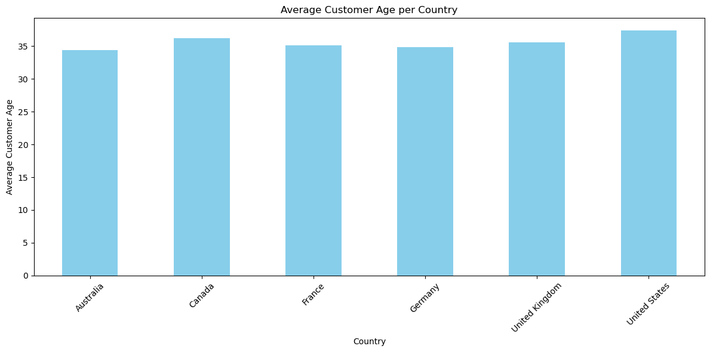

```python
import numpy as np
import pandas as pd
import matplotlib.pyplot as plt

%matplotlib inline

```


```python
sales = pd.read_csv( 'data/bike_sales.csv', parse_dates=['Date'])
```


```python
sales.head()
```


<div>
<table border="1" class="dataframe">
  <thead>
    <tr style="text-align: right;">
      <th></th>
      <th>Date</th>
      <th>Day</th>
      <th>Month</th>
      <th>Year</th>
      <th>Customer_Age</th>
      <th>Age_Group</th>
      <th>Customer_Gender</th>
      <th>Country</th>
      <th>State</th>
      <th>Product_Category</th>
      <th>Sub_Category</th>
      <th>Product</th>
      <th>Order_Quantity</th>
      <th>Unit_Cost</th>
      <th>Unit_Price</th>
      <th>Profit</th>
      <th>Cost</th>
      <th>Revenue</th>
    </tr>
  </thead>
  <tbody>
    <tr>
      <th>0</th>
      <td>2013-11-26</td>
      <td>26</td>
      <td>November</td>
      <td>2013</td>
      <td>19</td>
      <td>Youth (&lt;25)</td>
      <td>M</td>
      <td>Canada</td>
      <td>British Columbia</td>
      <td>Accessories</td>
      <td>Bike Racks</td>
      <td>Hitch Rack - 4-Bike</td>
      <td>8</td>
      <td>45</td>
      <td>120</td>
      <td>590</td>
      <td>360</td>
      <td>950</td>
    </tr>
    <tr>
      <th>1</th>
      <td>2015-11-26</td>
      <td>26</td>
      <td>November</td>
      <td>2015</td>
      <td>19</td>
      <td>Youth (&lt;25)</td>
      <td>M</td>
      <td>Canada</td>
      <td>British Columbia</td>
      <td>Accessories</td>
      <td>Bike Racks</td>
      <td>Hitch Rack - 4-Bike</td>
      <td>8</td>
      <td>45</td>
      <td>120</td>
      <td>590</td>
      <td>360</td>
      <td>950</td>
    </tr>
    <tr>
      <th>2</th>
      <td>2014-03-23</td>
      <td>23</td>
      <td>March</td>
      <td>2014</td>
      <td>49</td>
      <td>Adults (35-64)</td>
      <td>M</td>
      <td>Australia</td>
      <td>New South Wales</td>
      <td>Accessories</td>
      <td>Bike Racks</td>
      <td>Hitch Rack - 4-Bike</td>
      <td>23</td>
      <td>45</td>
      <td>120</td>
      <td>1366</td>
      <td>1035</td>
      <td>2401</td>
    </tr>
    <tr>
      <th>3</th>
      <td>2016-03-23</td>
      <td>23</td>
      <td>March</td>
      <td>2016</td>
      <td>49</td>
      <td>Adults (35-64)</td>
      <td>M</td>
      <td>Australia</td>
      <td>New South Wales</td>
      <td>Accessories</td>
      <td>Bike Racks</td>
      <td>Hitch Rack - 4-Bike</td>
      <td>20</td>
      <td>45</td>
      <td>120</td>
      <td>1188</td>
      <td>900</td>
      <td>2088</td>
    </tr>
    <tr>
      <th>4</th>
      <td>2014-05-15</td>
      <td>15</td>
      <td>May</td>
      <td>2014</td>
      <td>47</td>
      <td>Adults (35-64)</td>
      <td>F</td>
      <td>Australia</td>
      <td>New South Wales</td>
      <td>Accessories</td>
      <td>Bike Racks</td>
      <td>Hitch Rack - 4-Bike</td>
      <td>4</td>
      <td>45</td>
      <td>120</td>
      <td>238</td>
      <td>180</td>
      <td>418</td>
    </tr>
  </tbody>
</table>
</div>


```python
# Assuming you have already loaded the data into a DataFrame named 'sales'
mean_customer_age = sales['Customer_Age'].mean()
print("Mean Customer Age:", mean_customer_age)
```

    Mean Customer Age: 35.91921157861212
    


```python
import seaborn as sns

# KDE plot
plt.figure(figsize=(10, 6))
sns.kdeplot(data=sales['Customer_Age'], fill=True)
plt.title('Density Plot of Customer Age')
plt.xlabel('Customer Age')
plt.ylabel('Density')
plt.show()


```


    

    


```python

# Box plot
plt.figure(figsize=(8, 6))
sns.boxplot(x=sales['Customer_Age'])
plt.title('Box Plot of Customer Age')
plt.xlabel('Customer Age')
plt.show()
```


    

    


```python
mean_order_quantity = sales['Order_Quantity'].mean()
print("Mean Order Quantity:", mean_order_quantity)
```

    Mean Order Quantity: 11.901659648253654
    


```python
# Set up the figure and axes
fig, axes = plt.subplots(1, 2, figsize=(12, 6))

# Histogram
axes[0].hist(sales['Order_Quantity'], bins=20, color='skyblue', edgecolor='black')
axes[0].set_title('Histogram of Order Quantity')
axes[0].set_xlabel('Order Quantity')
axes[0].set_ylabel('Frequency')

# Box plot
sns.boxplot(x=sales['Order_Quantity'], ax=axes[1])
axes[1].set_title('Box Plot of Order Quantity')
axes[1].set_xlabel('Order Quantity')

plt.tight_layout()
plt.show()
```


    

    


```python
# Assuming the 'Date' column is in datetime format
sales['Year'] = sales['Date'].dt.year

# Group by year and count the number of sales
sales_per_year = sales.groupby('Year').size()

print("Sales per Year:")
print(sales_per_year)

```

    Sales per Year:
    Year
    2011     2677
    2012     2677
    2013    24443
    2014    29398
    2015    24443
    2016    29398
    dtype: int64
    


```python
# Assuming you have already calculated sales_per_year
sales_per_year.plot(kind='pie', autopct='%1.1f%%', figsize=(8, 8))
plt.title('Sales Distribution per Year')
plt.ylabel('')
plt.show()
```


    

    


```python
# Assuming the 'Date' column is in datetime format
sales['Month'] = sales['Date'].dt.month

# Group by month and count the number of sales
sales_per_month = sales.groupby('Month').size()

print("Sales per Month:")
print(sales_per_month)
```

    Sales per Month:
    Month
    1      9284
    2      9022
    3      9674
    4     10182
    5     11128
    6     11234
    7      7462
    8      8200
    9      8166
    10     8750
    11     8734
    12    11200
    dtype: int64
    


```python
# Assuming you have already calculated sales_per_month
sales_per_month.plot(kind='bar', color='skyblue', figsize=(10, 6))
plt.title('Sales per Month')
plt.xlabel('Month')
plt.ylabel('Number of Sales')
plt.xticks(rotation=0)  # Rotate x-axis labels if needed
plt.show()
```


    

    


```python
# Group by country and sum up the sales quantity
sales_per_country = sales.groupby('Country')['Order_Quantity'].sum()

# Find the country with the maximum sales quantity
country_with_most_sales = sales_per_country.idxmax()
max_sales_quantity = sales_per_country.max()

print("Country with the most sales quantity:", country_with_most_sales)
print("Sales quantity in that country:", max_sales_quantity)
```

    Country with the most sales quantity: United States
    Sales quantity in that country: 477539
    


```python
# Group by country and sum up the sales quantity
sales_per_country = sales.groupby('Country')['Order_Quantity'].sum()

# Sort the sales per country in descending order
sales_per_country = sales_per_country.sort_values(ascending=False)

# Plotting
plt.figure(figsize=(10, 6))
sales_per_country.plot(kind='bar', color='skyblue')
plt.title('Sales per Country')
plt.xlabel('Country')
plt.ylabel('Total Sales Quantity')
plt.xticks(rotation=45, ha='right')  # Rotate x-axis labels for better readability
plt.tight_layout()
plt.show()
```


    

    


```python
# Extract unique products
products_sold = sales['Product'].unique()

# Convert to list if needed
products_sold_list = products_sold.tolist()

print("List of every product sold:")
print(products_sold_list)

```

    List of every product sold:
    ['Hitch Rack - 4-Bike', 'All-Purpose Bike Stand', 'Mountain Bottle Cage', 'Water Bottle - 30 oz.', 'Road Bottle Cage', 'AWC Logo Cap', 'Bike Wash - Dissolver', 'Fender Set - Mountain', 'Half-Finger Gloves, L', 'Half-Finger Gloves, M', 'Half-Finger Gloves, S', 'Sport-100 Helmet, Black', 'Sport-100 Helmet, Red', 'Sport-100 Helmet, Blue', 'Hydration Pack - 70 oz.', 'Short-Sleeve Classic Jersey, XL', 'Short-Sleeve Classic Jersey, L', 'Short-Sleeve Classic Jersey, M', 'Short-Sleeve Classic Jersey, S', 'Long-Sleeve Logo Jersey, M', 'Long-Sleeve Logo Jersey, XL', 'Long-Sleeve Logo Jersey, L', 'Long-Sleeve Logo Jersey, S', 'Mountain-100 Silver, 38', 'Mountain-100 Silver, 44', 'Mountain-100 Black, 48', 'Mountain-100 Silver, 48', 'Mountain-100 Black, 38', 'Mountain-200 Silver, 38', 'Mountain-100 Black, 44', 'Mountain-100 Silver, 42', 'Mountain-200 Black, 46', 'Mountain-200 Silver, 42', 'Mountain-200 Silver, 46', 'Mountain-200 Black, 38', 'Mountain-100 Black, 42', 'Mountain-200 Black, 42', 'Mountain-400-W Silver, 46', 'Mountain-500 Silver, 40', 'Mountain-500 Silver, 44', 'Mountain-500 Black, 48', 'Mountain-500 Black, 40', 'Mountain-400-W Silver, 42', 'Mountain-500 Silver, 52', 'Mountain-500 Black, 52', 'Mountain-500 Silver, 42', 'Mountain-500 Black, 44', 'Mountain-500 Silver, 48', 'Mountain-400-W Silver, 38', 'Mountain-400-W Silver, 40', 'Mountain-500 Black, 42', 'Road-150 Red, 48', 'Road-150 Red, 62', 'Road-750 Black, 48', 'Road-750 Black, 58', 'Road-750 Black, 52', 'Road-150 Red, 52', 'Road-150 Red, 44', 'Road-150 Red, 56', 'Road-750 Black, 44', 'Road-350-W Yellow, 40', 'Road-350-W Yellow, 42', 'Road-250 Black, 44', 'Road-250 Black, 48', 'Road-350-W Yellow, 48', 'Road-550-W Yellow, 44', 'Road-550-W Yellow, 38', 'Road-250 Black, 52', 'Road-550-W Yellow, 48', 'Road-250 Red, 58', 'Road-250 Black, 58', 'Road-250 Red, 52', 'Road-250 Red, 48', 'Road-250 Red, 44', 'Road-550-W Yellow, 42', 'Road-550-W Yellow, 40', 'Road-650 Red, 48', 'Road-650 Red, 60', 'Road-650 Black, 48', 'Road-350-W Yellow, 44', 'Road-650 Red, 52', 'Road-650 Black, 44', 'Road-650 Red, 62', 'Road-650 Red, 58', 'Road-650 Black, 60', 'Road-650 Black, 58', 'Road-650 Black, 52', 'Road-650 Black, 62', 'Road-650 Red, 44', "Women's Mountain Shorts, M", "Women's Mountain Shorts, S", "Women's Mountain Shorts, L", 'Racing Socks, L', 'Racing Socks, M', 'Mountain Tire Tube', 'Touring Tire Tube', 'Patch Kit/8 Patches', 'HL Mountain Tire', 'LL Mountain Tire', 'Road Tire Tube', 'LL Road Tire', 'Touring Tire', 'ML Mountain Tire', 'HL Road Tire', 'ML Road Tire', 'Touring-1000 Yellow, 50', 'Touring-1000 Blue, 46', 'Touring-1000 Yellow, 60', 'Touring-1000 Blue, 50', 'Touring-3000 Yellow, 50', 'Touring-3000 Blue, 54', 'Touring-3000 Blue, 58', 'Touring-3000 Yellow, 44', 'Touring-3000 Yellow, 54', 'Touring-3000 Blue, 62', 'Touring-3000 Blue, 44', 'Touring-1000 Blue, 54', 'Touring-1000 Yellow, 46', 'Touring-1000 Blue, 60', 'Touring-3000 Yellow, 62', 'Touring-1000 Yellow, 54', 'Touring-2000 Blue, 54', 'Touring-3000 Blue, 50', 'Touring-3000 Yellow, 58', 'Touring-2000 Blue, 46', 'Touring-2000 Blue, 50', 'Touring-2000 Blue, 60', 'Classic Vest, L', 'Classic Vest, M', 'Classic Vest, S']
    


```python
# Group by product and sum up the sales quantity
sales_per_product = sales.groupby('Product')['Order_Quantity'].sum()

# Select the top 10 best selling products
top_10_products = sales_per_product.nlargest(10)

# Plotting
plt.figure(figsize=(10, 6))
top_10_products.plot(kind='bar', color='skyblue')
plt.title('Top 10 Best Selling Products')
plt.xlabel('Product')
plt.ylabel('Total Sales Quantity')
plt.xticks(rotation=45, ha='right')  # Rotate x-axis labels for better readability
plt.tight_layout()
plt.show()
```


    

    


```python
plt.figure(figsize=(8, 6))
plt.scatter(sales['Unit_Cost'], sales['Unit_Price'], alpha=0.5)
plt.title('Relationship between Unit Cost and Unit Price')
plt.xlabel('Unit Cost')
plt.ylabel('Unit Price')
plt.grid(True)
plt.show()
```


    

    


```python
plt.figure(figsize=(8, 6))
plt.scatter(sales['Order_Quantity'], sales['Profit'], alpha=0.5)
plt.title('Relationship between Order Quantity and Profit')
plt.xlabel('Order Quantity')
plt.ylabel('Profit')
plt.grid(True)
plt.show()
```


    

    


```python
plt.figure(figsize=(12, 6))
sns.boxplot(x='Country', y='Profit', data=sales)
plt.title('Profit Distribution per Country')
plt.xlabel('Country')
plt.ylabel('Profit')
plt.xticks(rotation=45)
plt.show()
```


    

    


```python
# Group by country and calculate mean profit
profit_per_country = sales.groupby('Country')['Profit'].mean()

plt.figure(figsize=(12, 6))
profit_per_country.plot(kind='bar', color='skyblue')
plt.title('Average Profit per Country')
plt.xlabel('Country')
plt.ylabel('Average Profit')
plt.xticks(rotation=45)
plt.tight_layout()
plt.show()
```


    

    


```python
plt.figure(figsize=(12, 6))
sns.boxplot(x='Country', y='Customer_Age', data=sales)
plt.title('Customer Age Distribution per Country')
plt.xlabel('Country')
plt.ylabel('Customer Age')
plt.xticks(rotation=45)
plt.show()
```


    

    


```python
# Group by country and calculate mean customer age
age_per_country = sales.groupby('Country')['Customer_Age'].mean()

plt.figure(figsize=(12, 6))
age_per_country.plot(kind='bar', color='skyblue')
plt.title('Average Customer Age per Country')
plt.xlabel('Country')
plt.ylabel('Average Customer Age')
plt.xticks(rotation=45)
plt.tight_layout()
plt.show()
```


    

    


```python
# Assuming 'Day', 'Month', and 'Year' columns exist
sales['Calculated_Date'] = pd.to_datetime(sales[['Year', 'Month', 'Day']])

# Display the DataFrame with the new column
print(sales.head())
```

            Date  Day  Month  Year  Customer_Age       Age_Group Customer_Gender  \
    0 2013-11-26   26     11  2013            19     Youth (<25)               M   
    1 2015-11-26   26     11  2015            19     Youth (<25)               M   
    2 2014-03-23   23      3  2014            49  Adults (35-64)               M   
    3 2016-03-23   23      3  2016            49  Adults (35-64)               M   
    4 2014-05-15   15      5  2014            47  Adults (35-64)               F   
    
         Country             State Product_Category Sub_Category  \
    0     Canada  British Columbia      Accessories   Bike Racks   
    1     Canada  British Columbia      Accessories   Bike Racks   
    2  Australia   New South Wales      Accessories   Bike Racks   
    3  Australia   New South Wales      Accessories   Bike Racks   
    4  Australia   New South Wales      Accessories   Bike Racks   
    
                   Product  Order_Quantity  Unit_Cost  Unit_Price  Profit  Cost  \
    0  Hitch Rack - 4-Bike               8         45         120     590   360   
    1  Hitch Rack - 4-Bike               8         45         120     590   360   
    2  Hitch Rack - 4-Bike              23         45         120    1366  1035   
    3  Hitch Rack - 4-Bike              20         45         120    1188   900   
    4  Hitch Rack - 4-Bike               4         45         120     238   180   
    
       Revenue Calculated_Date  
    0      950      2013-11-26  
    1      950      2015-11-26  
    2     2401      2014-03-23  
    3     2088      2016-03-23  
    4      418      2014-05-15  
    


```python
# Assuming 'Calculated_Date' column is in string format
sales['Calculated_Date'] = pd.to_datetime(sales['Calculated_Date'])

# Display the DataFrame with the parsed column
print(sales.head())
```

            Date  Day  Month  Year  Customer_Age       Age_Group Customer_Gender  \
    0 2013-11-26   26     11  2013            19     Youth (<25)               M   
    1 2015-11-26   26     11  2015            19     Youth (<25)               M   
    2 2014-03-23   23      3  2014            49  Adults (35-64)               M   
    3 2016-03-23   23      3  2016            49  Adults (35-64)               M   
    4 2014-05-15   15      5  2014            47  Adults (35-64)               F   
    
         Country             State Product_Category Sub_Category  \
    0     Canada  British Columbia      Accessories   Bike Racks   
    1     Canada  British Columbia      Accessories   Bike Racks   
    2  Australia   New South Wales      Accessories   Bike Racks   
    3  Australia   New South Wales      Accessories   Bike Racks   
    4  Australia   New South Wales      Accessories   Bike Racks   
    
                   Product  Order_Quantity  Unit_Cost  Unit_Price  Profit  Cost  \
    0  Hitch Rack - 4-Bike               8         45         120     590   360   
    1  Hitch Rack - 4-Bike               8         45         120     590   360   
    2  Hitch Rack - 4-Bike              23         45         120    1366  1035   
    3  Hitch Rack - 4-Bike              20         45         120    1188   900   
    4  Hitch Rack - 4-Bike               4         45         120     238   180   
    
       Revenue Calculated_Date  
    0      950      2013-11-26  
    1      950      2015-11-26  
    2     2401      2014-03-23  
    3     2088      2016-03-23  
    4      418      2014-05-15  
    


```python
# Group sales by year and count the number of sales
sales_by_year = sales.groupby(sales['Calculated_Date'].dt.year).size()

# Plotting
plt.figure(figsize=(10, 6))
sales_by_year.plot(kind='line', marker='o', color='skyblue')
plt.title('Sales Evolution Through the Years')
plt.xlabel('Year')
plt.ylabel('Number of Sales')
plt.grid(True)
plt.show()
```


    

    


```python
# Assuming 'Revenue' column exists in your DataFrame
sales['Revenue'] += 50

# Display the DataFrame with updated revenue
print(sales.head())

```

            Date  Day  Month  Year  Customer_Age       Age_Group Customer_Gender  \
    0 2013-11-26   26     11  2013            19     Youth (<25)               M   
    1 2015-11-26   26     11  2015            19     Youth (<25)               M   
    2 2014-03-23   23      3  2014            49  Adults (35-64)               M   
    3 2016-03-23   23      3  2016            49  Adults (35-64)               M   
    4 2014-05-15   15      5  2014            47  Adults (35-64)               F   
    
         Country             State Product_Category Sub_Category  \
    0     Canada  British Columbia      Accessories   Bike Racks   
    1     Canada  British Columbia      Accessories   Bike Racks   
    2  Australia   New South Wales      Accessories   Bike Racks   
    3  Australia   New South Wales      Accessories   Bike Racks   
    4  Australia   New South Wales      Accessories   Bike Racks   
    
                   Product  Order_Quantity  Unit_Cost  Unit_Price  Profit  Cost  \
    0  Hitch Rack - 4-Bike               8         45         120     590   360   
    1  Hitch Rack - 4-Bike               8         45         120     590   360   
    2  Hitch Rack - 4-Bike              23         45         120    1366  1035   
    3  Hitch Rack - 4-Bike              20         45         120    1188   900   
    4  Hitch Rack - 4-Bike               4         45         120     238   180   
    
       Revenue Calculated_Date  
    0     1000      2013-11-26  
    1     1000      2015-11-26  
    2     2451      2014-03-23  
    3     2138      2016-03-23  
    4      468      2014-05-15  
    


```python
# Assuming 'Country' column exists in your DataFrame
orders_in_canada_or_france = sales[(sales['Country'] == 'Canada') | (sales['Country'] == 'France')]

# Count the number of orders
num_orders_in_canada_or_france = len(orders_in_canada_or_france)

print("Number of orders made in Canada or France:", num_orders_in_canada_or_france)

```

    Number of orders made in Canada or France: 25176
    


```python
# Assuming 'Product' and 'Country' columns exist in your DataFrame
bike_racks_orders_canada = sales[(sales['Sub_Category'] == 'Bike Racks') & (sales['Country'] == 'Canada')]

# Count the number of Bike Racks orders made from Canada
num_bike_racks_orders_canada = len(bike_racks_orders_canada)

print("Number of Bike Racks orders made from Canada:", num_bike_racks_orders_canada)

```

    Number of Bike Racks orders made from Canada: 104
    


```python
# Assuming 'Region' and 'Country' columns exist in your DataFrame
orders_in_france = sales[sales['Country'] == 'France']
orders_per_region = orders_in_france.groupby('State').size()

# Plotting
plt.figure(figsize=(10, 6))
orders_per_region.plot(kind='bar', color='skyblue')
plt.title('Number of Orders in Each Region of France')
plt.xlabel('Region')
plt.ylabel('Number of Orders')
plt.xticks(rotation=45, ha='right')  # Rotate x-axis labels for better readability
plt.tight_layout()
plt.show()
```


    

    


```python
# Group by category and count the number of sales
sales_per_category = sales.groupby('Product_Category').size()

print("Sales per Category:")
print(sales_per_category)

```

    Sales per Category:
    Product_Category
    Accessories    70120
    Bikes          25982
    Clothing       16934
    dtype: int64
    


```python
# Assuming you have already calculated sales_per_category
plt.figure(figsize=(8, 8))
sales_per_category.plot(kind='pie', autopct='%1.1f%%', startangle=90, colors=['skyblue', 'lightgreen', 'lightcoral'])
plt.title('Sales Distribution per Category')
plt.ylabel('')
plt.show()
```


    

    


```python
# Filter the DataFrame to include only accessory products
accessory_orders = sales[sales['Product_Category'] == 'Accessories']

# Group by sub-category and count the number of orders
orders_per_subcategory = accessory_orders.groupby('Sub_Category').size()

print("Orders per Accessory Sub-category:")
print(orders_per_subcategory)

```

    Orders per Accessory Sub-category:
    Sub_Category
    Bike Racks             592
    Bike Stands            456
    Bottles and Cages    15876
    Cleaners              1802
    Fenders               4032
    Helmets              12158
    Hydration Packs       1334
    Tires and Tubes      33870
    dtype: int64
    


```python
# Assuming you have already calculated orders_per_subcategory
plt.figure(figsize=(10, 6))
orders_per_subcategory.plot(kind='bar', color='skyblue')
plt.title('Number of Orders per Accessory Sub-category')
plt.xlabel('Accessory Sub-category')
plt.ylabel('Number of Orders')
plt.xticks(rotation=45, ha='right')  # Rotate x-axis labels for better readability
plt.tight_layout()
plt.show()
```


    

    


```python
# Filter the DataFrame to include only bike products
bike_orders = sales[sales['Product_Category'] == 'Bikes']

# Group by sub-category and count the number of orders
orders_per_bike_subcategory = bike_orders.groupby('Sub_Category').size()

print("Orders per Bike Sub-category:")
print(orders_per_bike_subcategory)

```

    Orders per Bike Sub-category:
    Sub_Category
    Mountain Bikes     8854
    Road Bikes        13430
    Touring Bikes      3698
    dtype: int64
    


```python
# Assuming you have already calculated orders_per_bike_subcategory
plt.figure(figsize=(8, 8))
orders_per_bike_subcategory.plot(kind='pie', autopct='%1.1f%%', startangle=90)
plt.title('Orders Distribution per Bike Sub-category')
plt.ylabel('')
plt.show()
```


    

    


```python
# Group by gender and sum up the total sales amount
sales_per_gender = sales.groupby('Customer_Gender')['Revenue'].sum()

# Find the gender with the maximum sales amount
gender_with_most_sales = sales_per_gender.idxmax()
max_sales_amount = sales_per_gender.max()

print("Gender with the most amount of sales:", gender_with_most_sales)
print("Total sales amount for that gender:", max_sales_amount)

```

    Gender with the most amount of sales: M
    Total sales amount for that gender: 46251009
    


```python
# Assuming 'Gender' and 'Revenue' columns exist in your DataFrame
sales_by_men_above_500 = sales[(sales['Customer_Gender'] == 'M') & (sales['Revenue'] > 500)]

# Count the number of sales
num_sales_by_men_above_500 = len(sales_by_men_above_500)

print("Number of sales with more than $500 in revenue made by men:", num_sales_by_men_above_500)

```

    Number of sales with more than $500 in revenue made by men: 23342
    


```python
# Sort the DataFrame by 'Revenue' column in descending order
top_5_sales = sales.sort_values(by='Revenue', ascending=False).head(5)

print("Top 5 sales with the highest revenue:")
print(top_5_sales)

```

    Top 5 sales with the highest revenue:
                 Date  Day  Month  Year  Customer_Age       Age_Group  \
    112073 2015-07-24   24      7  2015            52  Adults (35-64)   
    112072 2013-07-24   24      7  2013            52  Adults (35-64)   
    71129  2011-07-08    8      7  2011            22     Youth (<25)   
    70307  2011-04-30   30      4  2011            44  Adults (35-64)   
    70601  2011-09-30   30      9  2011            19     Youth (<25)   
    
           Customer_Gender    Country             State Product_Category  \
    112073               M  Australia        Queensland         Clothing   
    112072               M  Australia        Queensland         Clothing   
    71129                M     Canada           Alberta            Bikes   
    70307                M     Canada  British Columbia            Bikes   
    70601                F     Canada  British Columbia            Bikes   
    
           Sub_Category                  Product  Order_Quantity  Unit_Cost  \
    112073        Vests  Touring-1000 Yellow, 50              29       1482   
    112072        Vests  Touring-1000 Yellow, 50              27       1482   
    71129    Road Bikes         Road-150 Red, 48               4       2171   
    70307    Road Bikes         Road-150 Red, 62               4       2171   
    70601    Road Bikes         Road-150 Red, 62               4       2171   
    
            Unit_Price  Profit   Cost  Revenue Calculated_Date  
    112073        2384   15096  42978    58124      2015-07-24  
    112072        2384   14055  40014    54119      2013-07-24  
    71129         3578    5628   8684    14362      2011-07-08  
    70307         3578    5485   8684    14219      2011-04-30  
    70601         3578    5485   8684    14219      2011-09-30  
    


```python
# Find the index of the sale with the highest revenue
idx_max_revenue = sales['Revenue'].idxmax()

# Get the sale with the highest revenue
sale_highest_revenue = sales.loc[idx_max_revenue]

print("Sale with the highest revenue:")
print(sale_highest_revenue)

```

    Sale with the highest revenue:
    Date                    2015-07-24 00:00:00
    Day                                      24
    Month                                     7
    Year                                   2015
    Customer_Age                             52
    Age_Group                    Adults (35-64)
    Customer_Gender                           M
    Country                           Australia
    State                            Queensland
    Product_Category                   Clothing
    Sub_Category                          Vests
    Product             Touring-1000 Yellow, 50
    Order_Quantity                           29
    Unit_Cost                              1482
    Unit_Price                             2384
    Profit                                15096
    Cost                                  42978
    Revenue                               58124
    Calculated_Date         2015-07-24 00:00:00
    Name: 112073, dtype: object
    


```python
# Filter the DataFrame to include only orders with less than $10,000 in revenue
orders_less_than_10k_revenue = sales[sales['Revenue'] < 10000]

# Calculate the mean Order_Quantity
mean_order_quantity_less_than_10k = orders_less_than_10k_revenue['Order_Quantity'].mean()

print("Mean Order_Quantity of orders with less than $10,000 in revenue:", mean_order_quantity_less_than_10k)

```

    Mean Order_Quantity of orders with less than $10,000 in revenue: 11.914539380997528
    


```python
# Filter the DataFrame to include only orders made in May 2016
orders_in_may_2016 = sales[(sales['Calculated_Date'].dt.month == 5) & (sales['Calculated_Date'].dt.year == 2016)]

# Count the number of orders
num_orders_in_may_2016 = len(orders_in_may_2016)

print("Number of orders made in May 2016:", num_orders_in_may_2016)

```

    Number of orders made in May 2016: 5015
    


```python
# Define the tax rate
tax_rate = 0.072  # 7.2%

# Update the Unit_Price column for sales within the United States
sales.loc[sales['Country'] == 'United States', 'Unit_Price'] *= (1 + tax_rate)

# Display the updated DataFrame
print(sales.head())

```

            Date  Day  Month  Year  Customer_Age       Age_Group Customer_Gender  \
    0 2013-11-26   26     11  2013            19     Youth (<25)               M   
    1 2015-11-26   26     11  2015            19     Youth (<25)               M   
    2 2014-03-23   23      3  2014            49  Adults (35-64)               M   
    3 2016-03-23   23      3  2016            49  Adults (35-64)               M   
    4 2014-05-15   15      5  2014            47  Adults (35-64)               F   
    
         Country             State Product_Category Sub_Category  \
    0     Canada  British Columbia      Accessories   Bike Racks   
    1     Canada  British Columbia      Accessories   Bike Racks   
    2  Australia   New South Wales      Accessories   Bike Racks   
    3  Australia   New South Wales      Accessories   Bike Racks   
    4  Australia   New South Wales      Accessories   Bike Racks   
    
                   Product  Order_Quantity  Unit_Cost  Unit_Price  Profit  Cost  \
    0  Hitch Rack - 4-Bike               8         45       120.0     590   360   
    1  Hitch Rack - 4-Bike               8         45       120.0     590   360   
    2  Hitch Rack - 4-Bike              23         45       120.0    1366  1035   
    3  Hitch Rack - 4-Bike              20         45       120.0    1188   900   
    4  Hitch Rack - 4-Bike               4         45       120.0     238   180   
    
       Revenue Calculated_Date  
    0     1000      2013-11-26  
    1     1000      2015-11-26  
    2     2451      2014-03-23  
    3     2138      2016-03-23  
    4      468      2014-05-15  
    


```python

```
